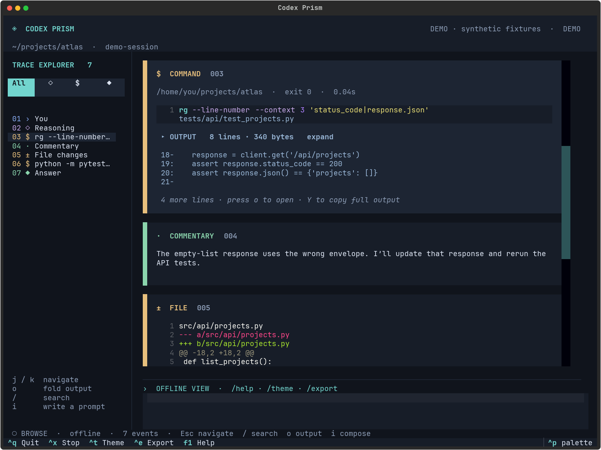

# Codex Prism

**Codex в терминале, с читаемой и настраиваемой трассой работы.**

Полные команды с подсветкой, раскрываемый вывод, отдельные блоки reasoning, комментариев и ответов. Поиск видит и свёрнутый текст. Цвета, подсветка токенов, клавиши и оформление меняются через TOML и CSS.



Prism — отдельный клиент для установленного `codex app-server`. Движок, модели, инструменты и авторизация остаются в Codex. Пересобирать Rust или поддерживать расходящийся форк движка не требуется. Проверенная версия: **codex-cli 0.153.3**. Основа интеграции: [официальный App Server](https://developers.openai.com/codex/app-server).

## Запуск

Нужны Python 3.11+, [uv](https://docs.astral.sh/uv/) и установленный, авторизованный Codex (`codex login`). Демо и просмотр записей работают без Codex и без обращения к модели.

```bash
cd codex-prism
uv sync --locked
uv run codex-prism --demo
uv run codex-prism --doctor
uv run codex-prism -C /path/to/project
```

Для установки отдельной команды:

```bash
uv tool install --editable .
codex-prism -C /path/to/project
```

В подготовленном рабочем окружении уже установлен локальный launcher `codex-prism`, связанный с `.venv` этого репозитория. Обычная команда `codex` не заменяется.

```bash
codex-prism --demo
codex-prism -C ~/project/my-project
codex-prism --resume THREAD_UUID
codex-prism -m YOUR_MODEL -C ~/project/my-project
```

Prism наследует модель, провайдера и разрешения из Codex. Явные переопределения: `--model`, `--sandbox`, `--approval`, `-c KEY=VALUE`. Сам клиент не включает full access и не подтверждает запросы автоматически. Если в окружении выставлен `NO_COLOR`, уберите его для цветного интерфейса: `env -u NO_COLOR codex-prism --demo`.

## Что видно

| Блок | Что отображается |
| --- | --- |
| Reasoning | Поле `content` и поток `item/reasoning/textDelta`, когда сервер их присылает. `summary` показан отдельно. Текст дополнительно не пересказывается. |
| Command | Полная строка команды, рабочая директория, exit code и длительность. Флаги, строки, пути и shell-синтаксис подсвечиваются. |
| Output | Все полученные фрагменты вывода. В свёрнутом виде — первые несколько строк и полный размер; раскрытие показывает текст с навигацией по страницам. |
| Tool | Аргументы и результаты MCP/dynamic tool calls; для неизвестных типов item — исходные поля. |
| File | Пути и diff с подсветкой добавленных/удалённых строк. |
| Commentary / Answer | Раздельные сообщения по `phase`, Markdown и кодовые блоки. |

**Граница полноты:** Prism показывает данные, полученные от `app-server`. Настройка `show_raw_agent_reasoning` не гарантирует, что каждый провайдер и каждый ход вернёт `content`. В проверочном живом ходе пришёл только summary; отдельный content проверен протокольными/UI-тестами. Клиент не извлекает отсутствующие или зашифрованные внутренние данные. Если сервер сам обрезал вывод, Prism не может восстановить неполученные байты. Обнаруженные отметки об обрезке показаны в интерфейсе.

Вывод проверен и на реальном Codex: **2 000 строк / 32 000 байт** получены полностью, хотя в запросе инструмента использовался меньший лимит результата. В тесте редуктора более длинный поток также сохраняется, если итоговое событие содержит укороченную копию.

## Управление

`Ctrl+Enter` / `Alt+Enter` отправляет сообщение; `Enter` добавляет строку. Во время работы следующее сообщение направляется через `turn/steer`.

Нажмите **Esc**, чтобы перейти от ввода к навигации:

| Клавиша | Действие |
| --- | --- |
| `j` / `k` | Следующее / предыдущее событие |
| `i` | Вернуться к вводу |
| `/` | Поиск по полному тексту, включая свёрнутый вывод |
| `o` / `O` | Раскрыть выбранный / все результаты |
| `y` / `Y` | Скопировать полную команду / полный вывод |
| `f` / `G` | Включить следование / перейти к последнему событию |
| `Ctrl+B` | Скрыть/показать оглавление |
| `Ctrl+T` | Следующая тема |
| `Ctrl+R` | Перечитать настройки оформления |
| `Ctrl+J` | Исходные поля выбранного события |
| `Ctrl+E` | Экспорт всей трассы в Markdown |
| `Ctrl+X` | Прервать ход |
| `Ctrl+Q` | Закрыть клиент, прервав активный ход |
| `F1` | Справка |

Колесо вверх и выбор старого события отключают следование. При ширине терминала меньше 96 колонок оглавление автоматически скрывается. Копирование использует OSC 52: оно зависит от поддержки терминалом; экспорт работает независимо от буфера обмена.

Команды в поле ввода: `/new`, `/sessions`, `/resume UUID`, `/theme prism`, `/theme ember`, `/theme daylight`, `/export [PATH]`, `/stop`, `/help`. Переключать сессию можно после завершения или прерывания хода. Перед продолжением существующего thread закройте другой клиент, работающий с ним.

## Настройка

```bash
codex-prism --init-config
# ~/.config/codex-prism/config.toml
```

Три готовые палитры: **prism**, **ember**, **daylight**. Можно изменить любой цвет, тему Pygments, отдельные классы токенов, перенос строк, нумерацию, размер страниц, превью вывода и клавиши. Для геометрии блоков подключается собственный файл Textual CSS. Пример с комментариями: [examples/config.toml](examples/config.toml). Подробная инструкция: [docs/CUSTOMIZATION.md](docs/CUSTOMIZATION.md).

## Запись и просмотр

По умолчанию клиент пишет приватный журнал JSONL, сжатый gzip, в `~/.local/state/codex-prism/traces/`. Это поток событий, а не скриншот; раскрывать его можно и после завершения сессии. Файлы создаются с правами `0600`. Записи содержат текст сессии, команды и вывод; они не входят в Git. Выключить запись: `--no-record` или `[behavior] record = false`.

```bash
codex-prism --replay ~/.local/state/codex-prism/traces/FILE.trace.jsonl.gz
codex-prism --replay FILE.trace.jsonl.gz --export trace.md
```

Экспорт никогда не перезаписывает существующий файл. Записи Prism и app-server JSONL поддерживаются; внутренний формат `~/.codex/sessions/rollout-*.jsonl` напрямую не импортируется — для существующей сессии используйте `--resume UUID`.

## Обновления и разработка

```bash
# После обновления установленного Codex:
codex-prism --doctor
uv run python scripts/check_protocol.py
uv run pytest -q

# После изменения самого Prism:
uv sync --locked
uv run ruff check src tests scripts
uv run ruff format --check src tests scripts
uv run pytest -q
uv build
```

[Архитектура и обновления](docs/ARCHITECTURE.md) · [Проверки и их границы](docs/VALIDATION.md)

Это первая самостоятельная версия интерфейса, а не копия всех экранов официального CLI. Здесь нет интерактивного login, графического показа изображений, встроенного терминала для ручных команд и полного набора slash-команд Codex. Для авторизации используйте `codex login`; неизвестные запросы расширений завершаются явной ошибкой, а неподдерживаемые MCP-формы можно отменить. Shell, изменения файлов, текстовые инструменты, обычные подтверждения и вопросы, новые/возобновляемые сессии поддерживаются.

## GitHub

Локальный репозиторий независим от родительского workspace. Для создания приватного репозитория после авторизации GitHub:

```bash
gh auth login
gh repo create enrifermi/codex-prism --private --source=. --remote=origin --push
```

Если репозиторий уже создан через сайт:

```bash
git remote add origin git@github.com:enrifermi/codex-prism.git
git push -u origin main
```

MIT. Unofficial client; not an OpenAI product.
